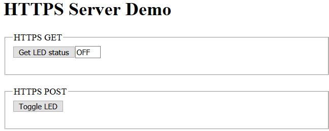

# PSoC 6 MCU: HTTPS Server

This code example demonstrates the implementation of an HTTPS server with PSoC® 6 MCU and CYW43xxx connectivity devices.

It employs the [HTTPS Server](https://github.com/cypresssemiconductorco/http-server) middleware library, which takes care of all the underlying socket connections with the HTTPS client. In this example, the HTTPS server establishes a secure connection with a HTTPS client through SSL handshake. Once the SSL handshake completes successfully, the HTTPS client can make GET, POST, and PUT requests with the server.

Tested with Mbed OS v6.2.1.

## Requirements

- Programming Language: C/C++
- Associated Parts: All [PSoC® 6 MCU](http://www.cypress.com/PSoC6) parts
- [Mbed CLI](https://github.com/ARMmbed/mbed-cli)
- [ModusToolbox v2.1](https://www.cypress.com/documentation/software-and-drivers/modustoolbox-software-archives) or later

  **Note:** You do not need to install ModusToolbox to build and run this code example. However, installing it is required when you need to:

  * Debug using the Eclipse for ModusToolbox IDE. See the [user guide](https://www.cypress.com/MTBEclipseIDEUserGuide) for details.
  * Customize the default device configuration using any of the Configurator tools
  * Port this code example to a new target that is not listed under the **Supported Kits**

## Supported Toolchains (Mbed CLI argument `--toolchain`)

- [GNU Arm® Embedded Compiler v9.2.1](https://developer.arm.com/open-source/gnu-toolchain/gnu-rm/downloads) (GCC_ARM)
- [Arm compiler v6.14](https://developer.arm.com/tools-and-software/embedded/arm-compiler/downloads/version-6) (ARM)

## Supported Kits (Mbed CLI argument `--target`)

- [PSoC 6 Wi-Fi BT Prototyping Kit](https://www.cypress.com/CY8CPROTO-062-4343W) (CY8CPROTO-062-4343W)
- [PSoC 62S2 Wi-Fi BT Pioneer Kit](https://www.cypress.com/CY8CKIT-062S2-43012) (CY8CKIT-062S2-43012)
- [PSoC 62 Wi-Fi BT Pioneer Kit](https://www.cypress.com/CY8CKIT-062-WIFI-BT) (CY8CKIT-062-WIFI-BT)
- [PSoC 62S3 Wi-Fi BT Prototyping Kit](https://www.cypress.com/CY8CPROTO-062S3-4343W) (CY8CPROTO-062S3-4343W)
- [PSoC 62S1 Wi-Fi BT Pioneer Kit](https://www.cypress.com/CYW9P62S1-43438EVB-01) (CYWP62S1-43438EVB-01)
- [PSoC 62S1 Wi-Fi BT Pioneer Kit](https://www.cypress.com/CYW9P62S1-43012EVB-01) (CYWP62S1-43012EVB-01)

## Hardware Setup

This example uses the board's default configuration. See the kit user guide to ensure that the board is configured correctly.

**Note:** The PSoC 6 BLE Pioneer Kit (CY8CKIT-062-BLE) and the PSoC 6 WiFi-BT Pioneer Kit (CY8CKIT-062-WIFI-BT) ship with KitProg2 installed. The ModusToolbox software requires KitProg3. Before using this code example, make sure that the board is upgraded to KitProg3. The tool and instructions are available in the [Firmware Loader](https://github.com/cypresssemiconductorco/Firmware-loader) GitHub repository. If you do not upgrade, you will see an error like "unable to find CMSIS-DAP device" or "KitProg firmware is out of date".

For Mbed OS, the kit must be in DAPLink mode. Refer the **KitProg3 User Guide** (found in the Documentation tab in the [Cypress Programming Solutions](https://www.cypress.com/products/psoc-programming-solutions) web page) for details of how to put the Pioneer Kit into DAPLINK mode.

## Software Setup

- Install a terminal emulator such as [Tera Term](https://ttssh2.osdn.jp/index.html.en) or [PuTTY](https://www.putty.org/) if you don't have any.

- [OpenSSL](#prerequisites)

**Note:** This code example also uses the *cURL* utility to test the HTTPS server. This utility helps to send HTTPS GET, POST, and PUT requests to the server. The *cURL* utility (version 7.59.0) is already shipped with the [ModusToolbox v2.1](https://www.cypress.com/documentation/software-and-drivers/modustoolbox-software-archives); it is available under *{ModusToolbox install directory}/tools_\<version>/modus-shell/bin*).

## Import the Code Example using Mbed CLI Tool

Mbed CLI commands are used to import the code example and compile. See [Working with Mbed CLI web page](https://os.mbed.com/docs/mbed-os/v6.2/tools/working-with-mbed-cli.html).

```
mbed import https://github.com/cypresssemiconductorco/mbed-os-example-https-server
```

It first clones the code example repository from GitHub, and then deploys all the libraries. If you wish to perform the *deploy* process manually, follow the below commands:

Clone the GitHub code example repository:

```
git clone https://github.com/cypresssemiconductorco/mbed-os-example-https-server && cd mbed-os-example-https-server
```

Deploy the dependent libraries. The library files are identified with *.lib* extension.

```
mbed deploy
```

Set the current directory as *root*:

```
mbed new .
```

## Operation

1. Connect the board to your PC using the provided USB cable through the KitProg3 USB connector.

2. Open *mbed_app.json* and modify the `nsapi.default-wifi-ssid`, `nsapi.default-wifi-password`, and `nsapi.default-wifi-security` macros to match the credentials of the Wi-Fi network that you want to connect to.

3. Because this code example uses a self-signed SSL certificate, you need to generate the certificates required by the HTTPS server and client so that they can successfully establish a secure HTTPS connection. Follow the steps provided in a [separate section](#creating-a-self-signed-ssl-certificate) which explains how to generate the certificates.

4. Open the *source/secure_keys.h* file and do the following: 

   1. Modify `keySERVER_CERTIFICATE_PEM` with contents from the *mysecurehttpserver.local.crt* file generated in Step 3. 
   2. Modify `keySERVER_PRIVATE_KEY_PEM` with contents from the *mysecurehttpserver.local.key* file generated in Step 3.
   3. Modify `keyCLIENT_ROOTCA_PEM` with contents from the *rootCA.crt* file generated in step 3.

5. Program the board.

   ```
   mbed compile -m <TARGET> -t <TOOLCHAIN> --flash --sterm
   ```

   For example, to build for the target `CY8CPROTO_062_4343W` with `GCC_ARM` toolchain, use the following command:

   ```
   mbed compile -m CY8CPROTO_062_4343W -t GCC_ARM --flash --sterm
   ```

   **Note:** With the `--sterm` option, Mbed CLI opens a new terminal with 9600-8N1 as the setting after programming completes. Do not use this option if you want to connect using another serial terminal application such as PuTTY or Tera Term.

6. After programming, the application starts automatically. Verify that the following logs appear on the serial terminal:

   ```
   Info: ===================================
   Info: PSoC 6 MCU: HTTPS Server
   Info: ===================================
   
   WLAN MAC Address : A0:C9:A0:3D:D3:6A
   WLAN Firmware    : wl0: Jan 30 2020 21:41:53 version 7.45.98.95 (r724303 CY) FWID 01-5afc8c1e
   WLAN CLM         : API: 12.2 Data: 9.10.39 Compiler: 1.29.4 ClmImport: 1.36.3 Creation: 2020-01-30 21:30:05
   WHD VERSION      : v1.91.2 : v1.91.2 : GCC 9.2 : 2020-06-25 02:15:47 -0500
   Info: Successfully connected to AP: WIFI_SSID
   Info: IP Addr   : 192.168.0.109
   Info: HTTPS server has successfully started. The server is running with above IP address
   ```

7. The client needs to install the *rootCA.crt* to trust the HTTPS website and its own certificate *mysecurehttpclient.pfx*. The **.pfx* file bundles the client certificate and key in PKCS format.

   Do the following to install the certificates on the client machine. In this code example, the HTTPS server has two type of clients: one uses the cURL utility while the other uses a web browser.

    - **cURL utility:**

        - Ensure that the *cURL* utility has access to the *rootCA.crt*, *mysecurehttpclient.crt*, and *mysecurehttpclient.key* file generated in Step 3. cURL commands can be invoked from anywhere in your *mbed-cli* shell. The command takes the argument such as `--cacert`, `--cert`, and `--key` which indicates the file path to *rootCA.crt*, *mysecurehttpclient.crt*, and *mysecurehttpclient.key* respectively. See Step 10 for commands usage.

    - **Web browser:**

        - **Mozilla Firefox:**
            1. Select **Options** > **Privacy & Security** (Windows) or **Preferences** > **Privacy & Security** (macOS and Ubuntu).

            2. Find the **Certificates** section and then click **View Certificates**. 
              
               The browser displays the Certificate Manager dialog. 

            3. Click **Import** and select the *rootCA.crt* file generated in Step 3 and click **Open**.
            
            4. Trust this certificate authority to identify websites and email users and click **OK**.
              
               The **rootCA.crt** is now installed.

            5. Similarly, import the client certificate **mysecurehttpclient.pfx** under **Your Certificates** on the Certificate Manager window. The certificate was generated with empty password; therefore, leave it empty if it asks for a password during import.

        - **Google Chrome and Internet Explorer on Windows:**
            1. In the  Run dialog (click **Win key + R**) type **certmgr.msc** and click **OK**. 
            
               The Windows Certificate Manager application opens.

            2. Navigate to the *Trusted Root Certification Authorities/Certificates* folder.
            
            3. Go to **Action** > **All Tasks** > **Import** and click **Next**.

            4. Select the *rootCA.crt* file generated in Step 3. Make sure to change file type as **All Files** to find the *rootCA.crt* file. Click **Open**.
            
            5. Select the certification store as **Trusted Root Certification Authorities** and click **Finish**.
            
            6. Click **Yes** to the security warning window to acknowledge that you trust *rootCA.crt* to allow its websites and email users.
            
               The **rootCA.crt** is now installed.
            
            7. Similarly, import the client certificate **mysecurehttpclient.pfx** under **Personal** category. The certificate was generated with empty password; therefore, leave it empty if it asks for a password during import.

        - **Google Chrome (Ubuntu):**
            1. Select **Settings**  > **Show Advanced Settings** > **HTTPS/SSL**. Click **Manage Certificates** under **Security** tab.

            2. In the Certificate Manager window, click **Import** under the **Authorities** tab.
            
            3. Select the *rootCA.crt* file generated in step 3. Make sure to change file type as **All Files** to find the *rootCA.crt* file. Click **Open**.
            
            4. Trust this certificate authority to identify websites and email users and click **OK**.
            
               The **rootCA.crt** is now installed.
            
            5. Similarly, import the client certificate **mysecurehttpclient.pfx** under **Personal** category.

        - **Google Chrome (macOS):**
            1. Open **Finder** > **Applications** > **Utilities** > **Keychain Access**.
        
            2. Select the **System** keychain.
            
            3. Open **File** > **Import Items**, and import the certificate file *rootCA.crt* into the **System** keychain.
            
            4. Right-click the certificate and select **Get Info**. 
            
               A certificate information window appears.
            
            5. Expand the **Trust** category and select **Always Trust** to trust this certificate authority.
            
            6. Similarly, import the client certificate **mysecurehttpclient.pfx** under **MyCertificates** category. The certificate was generated with empty password; therefore, leave it empty if it asks for a password.

        **Note:** 

        - Browsers might need a restart after importing the certificate.

        - When importing the *mysecurehttpclient.pfx* file, the Chrome browser asks the user to set the **CryptoAPI Private Key** to protect the client certificate key from accessing it by the browser. The browser is given access to the client private key only after entering the correct key and **allowing** access by the user.

8. Ensure that your PC is connected to the same Wi-Fi access point that you have configured in Step 2. 

9. Get the IP address of the kit from the console logs. Enter `https://<IP address>:50007` in the browser to access the HTTPS server webpage.

## Test the HTTPS server

### Using Web Browser:

1. Enter the URL `https://<IP address>:50007`. This opens the HTML page; it will look like as follows:

   **Figure 1. HTTPS Web Page**

   

2. Click **Get LED status** to send an HTTPS `GET` command to the server running on the kit. 

   The server returns the current LED status on the kit as a response. Note that entering the URL itself will send a `GET` command to the server to get the HTML page.

3. Click **Toggle LED** to send an HTTPS `POST` command to the server running on the kit. 

   The server acts on the command request and toggles the LED on the kit.

### Using the cURL Utility:

1. Open *Cygwin.bat* from the modus-shell directory (*{ModusToolbox install directory}/tools_\<version>/modus-shell*).

2. Set the path to *rootCA.crt*, *mysecurehttpclient.crt*, and *mysecurehttpclient.key* in a variable.

   ```
   PATH_TO_ROOTCA="<Path to rootCA.crt file>"
   ```

   ```
   PATH_TO_CLIENT_CRT="<Path to mysecurehttpclient.crt file>"
   ```

   ```
   PATH_TO_CLIENT_KEY="<Path to mysecurehttpclient.key file>"
   ```

3. Set the path to HTTPS web page URL in a variable.

   ```
   HTTPS_SERVER_URL="https://<IP address>:<Port number>"
   ```

   For example:

   ```
   HTTPS_SERVER_URL="https://192.168.0.108:50007"
   ```

   where, `192.168.0.108` is the IP address of the target kit; `50007` is the HTTPS port number defined in *secure_http_server.h* file in the `HTTPS_PORT` macro.

4. Use the following *cURL* commands to test HTTPS commands with the HTTPS server: 

   1. **HTTPS GET:** Get the kit's LED status (ON or OFF).

      ```
      curl --cacert $PATH_TO_ROOTCA --cert $PATH_TO_CLIENT_CRT --key $PATH_TO_CLIENT_KEY -X GET $HTTPS_SERVER_URL --output -
      ```

   2. Verify that the HTTPS server responds with the following HTML output. This contains the LED status (ON or OFF) of the kit.

      ```
      <!DOCTYPE html><html><head><title>HTTPS Server Demo</title></head><body><h1>HTTPS Server Demo</h1><form method="get"><fieldset><legend>HTTPS GET</legend><input type="submit" value="Get LED status"/><input type="text" name="led_status" value="OFF" size="3" readonly/></br></br></fieldset></br></form><form method="post"><fieldset><legend>HTTPS POST</legend><input type="submit" name="toggle_led" value="Toggle LED"/></br></br></fieldset></br></form></body></html>
      ```

   3. **HTTPS POST:** Toggle the LED (ON or OFF) on the kit.

      ```
      curl --cacert $PATH_TO_ROOTCA --cert $PATH_TO_CLIENT_CRT --key $PATH_TO_CLIENT_KEY -X POST $HTTPS_SERVER_URL --output -
      ```

   4. Verify that the HTTPS server responds with the following HTML output. The response contains the LED status (ON or OFF) of the last `GET` request.

      ```
      <!DOCTYPE html><html><head><title>HTTPS Server Demo</title></head><body><h1>HTTPS Server Demo</h1><form method="get"><fieldset><legend>HTTPS GET</legend><input type="submit" value="Get LED status"/><input type="text" name="led_status" value="OFF" size="3" readonly/></br></br></fieldset></br></form><form method="post"><fieldset><legend>HTTPS POST</legend><input type="submit" name="toggle_led" value="Toggle LED"/></br></br></fieldset></br></form></body></html>
      ```

   5. **HTTPS PUT:** Register a new HTTP resource. The HTTPS server creates a new resource called *myhellomessage*.

      ```
      curl --cacert $PATH_TO_ROOTCA --cert $PATH_TO_CLIENT_CRT --key $PATH_TO_CLIENT_KEY -X PUT -d "/myhellomessage=Hello - Message from HTTPS server!" $HTTPS_SERVER_URL --output -
      ```

   6. Verify the newly created resource by sending an HTTPS `GET` request.
           
      ```
      curl --cacert $PATH_TO_ROOTCA --cert $PATH_TO_CLIENT_CRT --key $PATH_TO_CLIENT_KEY -X GET $HTTPS_SERVER_URL/myhellomessage --output -
      ```
      
   7. Verify that the HTTPS server responds with a Hello text message.
      ```
      Hello - Message from HTTPS server!
      ```

## Debugging

You can debug the example to step through the code. In the IDE, use the **\<Application Name> Debug (KitProg3_MiniProg4)** configuration in the **Quick Panel**. For more details, see the "Program and Debug" section in the [Eclipse IDE for ModusToolbox User Guide](https://www.cypress.com/MTBEclipseIDEUserGuide).

Follow the steps from [Eclipse IDE for ModusToolbox User Guide](https://www.cypress.com/MTBEclipseIDEUserGuide#page=23) to export the Mbed OS code example and import it into ModusToolbox IDE for programming and debugging.

Mbed OS also supports debugging using any IDE that supports GDB. We recommend the user to go through [ARM Mbed's documentation](https://os.mbed.com/docs/mbed-os/v6.2/debug-test/index.html) on the debugging steps.

**Note:** **(Only while debugging)** On the CM4 CPU, some code in `main()` may execute before the debugger halts at the beginning of `main()`. This means that some code executes twice - before the debugger stops execution, and again after the debugger resets the program counter to the beginning of `main()`. See [KBA231071](https://community.cypress.com/docs/DOC-21143) to learn about this and for the workaround.

## Design and Implementation

### Resources and Settings

**Table 1. Application Resources**

| Resource  |  Alias/Object     |    Purpose     |
| :------- | :------------    | :------------ |
| UART (HAL)|cy_retarget_io_uart_obj| UART HAL object used by Retarget-IO for Debug UART port  |
| GPIO (HAL)    | CYBSP_USER_LED         | User LED                  |

This example uses the Arm® Cortex®-M4 (CM4) CPU of PSoC 6 MCU to start the HTTPS server task. At device reset, the default Cortex-M0+ (CM0+) application enables the CM4 CPU and configures the CM0+ CPU to go to sleep.

In this example, the HTTPS server establishes a secure connection with a web browser or cURL client through SSL handshake. During the SSL handshake, the server presents its SSL certificate for verification and verifies the incoming client identity. 

You can define the maximum number of HTTPS page resources for the HTTPS server in the *mbed_app.json* file, as follows. The HTTPS server library maintains the database of pages based on this value.

```
"macros": ["MAX_NUMBER_OF_HTTP_SERVER_RESOURCES=<N>"],
```

Note that if the `MAX_NUMBER_OF_HTTP_SERVER_RESOURCES` value is not defined, the HTTPS server will set it to 10 by default. This code example does not define this parameter in the application *mbed_app.json*; therefore, the application uses the default value of 10. This depends on the availability of memory on the MCU device.

### Creating a Self-Signed SSL Certificate

The HTTPS server demonstrated in this example uses a self-signed SSL certificate. This means that there is no third-party certificate issuing authority, commonly referred to as CA, involved in the authentication of the server. Clients connecting to the server must have a root CA certificate to verify and trust the websites defined by the certificate. Only when the client trusts the website, it can establish secure connection with the HTTPS server.

1. Open *Cygwin.bat* from modus-shell directory (*{ModusToolbox install directory}/tools_\<version>/modus-shell*).

2. Do the following to generate a self-signed SSL certificate:

#### Prerequisites
The OpenSSL library is required to generate a self-signed certificate for the HTTPS server. 

1. Run the following command in your local environment to see if you already have OpenSSL installed.

   ```
   which openssl
   ```
2. Install OpenSSL if the `which` command does not return a path.

   | Operating System  |  Installation    |
   | :------- | :------------    |
   | Windows | [Windows OpenSSL installer](http://gnuwin32.sourceforge.net/packages/openssl.htm) |
   | Ubuntu Linux |`apt-get install openssl`|
   | macOS |[Homebrew](https://brew.sh/):`brew install openssl`|

#### Generate SSL Certificate and Private Key 
1. Run the following script to generate the self-signed SSL certificate and private key. 

   This code example does not use *mDNS* (Multicast Domain Name System). Therefore, the SSL certificates needs to be generated for the specific IP address obtained by the kit from the AP. For testing the code example, you should configure the kit to obtain a static IP address from the AP. See your AP's documentation, and set a static IP address for the kit's MAC address under test.

   Before invoking the following command, modify the `OPENSSL_SUBJECT_INFO` macro in the *generate_ssl_certs.sh* file to match your local domain configuration such as  *Country*, *State*, *Locality*, *Organization*, *Organization Unit name*, and *Common Name*. This macro is used by the *openssl* commands when generating the certificate.

   ```
   ./generate_ssl_certs.sh <IP address obtained by the kit>
   ```
   This will produce the following files:

   - **mysecurehttpserver.local.crt** - HTTPS server certificate.
   - **mysecurehttpserver.local.key** - HTTPS server private key.
   - **rootCA.crt** - HTTPS server rootCA certificate to trust the client.
   - **rootCA.key** - HTTPS server root key used for signing the certificate.
   - **mysecurehttpclient.crt** - HTTPS client certificate.
   - **mysecurehttpclient.key** - HTTPS client key.
   - **mysecurehttpclient.pfx** - Bundles the HTTPS client certificate and key in PKCS12 format.

The HTTPS server should be configured to take *mysecurehttpserver.local.crt* as the certificate, *mysecurehttpserver.local.key* as the private key, and *rootCA.crt* as the rootCA certificate.

You can either convert the values to strings manually following the format shown in *source/secure_keys.h* or use the HTML utility available [here](https://github.com/cypresssemiconductorco/amazon-freertos/blob/master/tools/certificate_configuration/PEMfileToCString.html) to convert the certificates and keys from PEM format to C string format. You need to clone the repository from GitHub to use the utility.

The *rootCA.crt* and *mysecurehttpclient.pfx* should be installed on the web browser clients which are trying to communicate with the HTTPS server. With *cURL*, the *rootCA.crt*, *mysecurehttpclient.crt*, and *mysecurehttpclient.key* can be passed as command-line arguments.

## Related Resources

| Application Notes                                            |                                                              |
| :----------------------------------------------------------- | :----------------------------------------------------------- |
| [AN228571](https://www.cypress.com/AN228571) – Getting Started with PSoC 6 MCU on ModusToolbox | Describes PSoC 6 MCU devices and how to build your first application with ModusToolbox |
| **Code Examples**                                            |                                                              |
| [Using ModusToolbox](https://github.com/cypresssemiconductorco/Code-Examples-for-ModusToolbox-Software) | [Using PSoC Creator](https://www.cypress.com/documentation/code-examples/psoc-6-mcu-code-examples) |
| **Device Documentation**                                     |                                                              |
| [PSoC 6 MCU Datasheets](https://www.cypress.com/search/all?f[0]=meta_type%3Atechnical_documents&f[1]=resource_meta_type%3A575&f[2]=field_related_products%3A114026) | [PSoC 6 Technical Reference Manuals](https://www.cypress.com/search/all/PSoC%206%20Technical%20Reference%20Manual?f[0]=meta_type%3Atechnical_documents&f[1]=resource_meta_type%3A583) |
| **Development Kits**                                         | Buy at www.cypress.com                                       |
| [CY8CKIT-062S2-43012 PSoC 62S2 WiFi-BT Pioneer Kit](http://www.cypress.com/CY8CKIT-062S2-43012) | [CY8CKIT-062-WiFi-BT PSoC 6   WiFi-BT Pioneer Kit](http://www.cypress.com/CY8CKIT-062-WiFi-BT) |
| [CY8CPROTO-062-4343W   PSoC 6 Wi-Fi BT Prototyping Kit](http://www.cypress.com/CY8CPROTO-062-4343w) | [CY8CPROTO-062S3-4343W PSoC 6   WiFi-BT Pioneer Kit](http://www.cypress.com/CY8CPROTO-062S3-4343W) |
| [CYW9P62S1-43438EVB-01](https://www.cypress.com/CYW9P62S1-43438EVB-01) PSoC 62S1 Wi-Fi BT Pioneer Kit | [CYW9P62S1-43012EVB-01](https://www.cypress.com/CYW9P62S1-43012EVB-01) PSoC 62S1 Wi-Fi BT Pioneer Kit |                                                             |                                                              |
| **Libraries**                                                |                                                              |
| PSoC 6 Peripheral Driver Library (PDL) and docs  | [psoc6pdl](https://github.com/cypresssemiconductorco/psoc6pdl) on GitHub |
| Cypress Hardware Abstraction Layer (HAL) Library and docs     | [psoc6hal](https://github.com/cypresssemiconductorco/psoc6hal) on GitHub |
| **Middleware**                                               |                                                              |
| http-server                                                  | [http-server](https://github.com/cypresssemiconductorco/http-server) on GitHub |
| Connectivity-Utilities                                       | [connectivity-utilities](https://github.com/cypresssemiconductorco/connectivity-utilities) on GitHub |
| Links to all PSoC 6 MCU Middleware                           | [psoc6-middleware](https://github.com/cypresssemiconductorco/psoc6-middleware) on GitHub |
| **Tools**                                                    |                                                              |
| [Eclipse IDE for ModusToolbox](https://www.cypress.com/modustoolbox)     | The cross-platform, Eclipse-based IDE for IoT designers that supports application configuration and development targeting converged MCU and wireless systems.             |
| [PSoC Creator™](https://www.cypress.com/products/psoc-creator-integrated-design-environment-ide) | The Cypress IDE for PSoC and FM0+ MCU development.            |

## Other Resources

Cypress provides a wealth of data at www.cypress.com to help you select the right device, and quickly and effectively integrate it into your design.

For PSoC 6 MCU devices, see [How to Design with PSoC 6 MCU - KBA223067](https://community.cypress.com/docs/DOC-14644) in the Cypress community.

## Document History

Document Title: *CE231064* - *PSoC 6 MCU: HTTPS Server*

| Version | Description of Change |
| ------- | --------------------- |
| 2.0.0   | Updated to Mbed OS v6.2.1.<br/>Updated README.md.<br/>Modified the code example behavior to demonstrate only secure mode. The repo name have changed accordingly.   |

------

All other trademarks or registered trademarks referenced herein are the property of their respective owners.


-------------------------------------------------------------------------------

© Cypress Semiconductor Corporation, 2020. This document is the property of Cypress Semiconductor Corporation and its subsidiaries ("Cypress"). This document, including any software or firmware included or referenced in this document ("Software"), is owned by Cypress under the intellectual property laws and treaties of the United States and other countries worldwide. Cypress reserves all rights under such laws and treaties and does not, except as specifically stated in this paragraph, grant any license under its patents, copyrights, trademarks, or other intellectual property rights. If the Software is not accompanied by a license agreement and you do not otherwise have a written agreement with Cypress governing the use of the Software, then Cypress hereby grants you a personal, non-exclusive, nontransferable license (without the right to sublicense) (1) under its copyright rights in the Software (a) for Software provided in source code form, to modify and reproduce the Software solely for use with Cypress hardware products, only internally within your organization, and (b) to distribute the Software in binary code form externally to end users (either directly or indirectly through resellers and distributors), solely for use on Cypress hardware product units, and (2) under those claims of Cypress's patents that are infringed by the Software (as provided by Cypress, unmodified) to make, use, distribute, and import the Software solely for use with Cypress hardware products. Any other use, reproduction, modification, translation, or compilation of the Software is prohibited.  
TO THE EXTENT PERMITTED BY APPLICABLE LAW, CYPRESS MAKES NO WARRANTY OF ANY KIND, EXPRESS OR IMPLIED, WITH REGARD TO THIS DOCUMENT OR ANY SOFTWARE OR ACCOMPANYING HARDWARE, INCLUDING, BUT NOT LIMITED TO, THE IMPLIED WARRANTIES OF MERCHANTABILITY AND FITNESS FOR A PARTICULAR PURPOSE. No computing device can be absolutely secure. Therefore, despite security measures implemented in Cypress hardware or software products, Cypress shall have no liability arising out of any security breach, such as unauthorized access to or use of a Cypress product. CYPRESS DOES NOT REPRESENT, WARRANT, OR GUARANTEE THAT CYPRESS PRODUCTS, OR SYSTEMS CREATED USING CYPRESS PRODUCTS, WILL BE FREE FROM CORRUPTION, ATTACK, VIRUSES, INTERFERENCE, HACKING, DATA LOSS OR THEFT, OR OTHER SECURITY INTRUSION (collectively, "Security Breach"). Cypress disclaims any liability relating to any Security Breach, and you shall and hereby do release Cypress from any claim, damage, or other liability arising from any Security Breach. In addition, the products described in these materials may contain design defects or errors known as errata which may cause the product to deviate from published specifications. To the extent permitted by applicable law, Cypress reserves the right to make changes to this document without further notice. Cypress does not assume any liability arising out of the application or use of any product or circuit described in this document. Any information provided in this document, including any sample design information or programming code, is provided only for reference purposes. It is the responsibility of the user of this document to properly design, program, and test the functionality and safety of any application made of this information and any resulting product. "High-Risk Device" means any device or system whose failure could cause personal injury, death, or property damage. Examples of High-Risk Devices are weapons, nuclear installations, surgical implants, and other medical devices. "Critical Component" means any component of a High-Risk Device whose failure to perform can be reasonably expected to cause, directly or indirectly, the failure of the High-Risk Device, or to affect its safety or effectiveness. Cypress is not liable, in whole or in part, and you shall and hereby do release Cypress from any claim, damage, or other liability arising from any use of a Cypress product as a Critical Component in a High-Risk Device. You shall indemnify and hold Cypress, its directors, officers, employees, agents, affiliates, distributors, and assigns harmless from and against all claims, costs, damages, and expenses, arising out of any claim, including claims for product liability, personal injury or death, or property damage arising from any use of a Cypress product as a Critical Component in a High-Risk Device. Cypress products are not intended or authorized for use as a Critical Component in any High-Risk Device except to the limited extent that (i) Cypress's published data sheet for the product explicitly states Cypress has qualified the product for use in a specific High-Risk Device, or (ii) Cypress has given you advance written authorization to use the product as a Critical Component in the specific High-Risk Device and you have signed a separate indemnification agreement.  
Cypress, the Cypress logo, Spansion, the Spansion logo, and combinations thereof, WICED, PSoC, CapSense, EZ-USB, F-RAM, and Traveo are trademarks or registered trademarks of Cypress in the United States and other countries. For a more complete list of Cypress trademarks, visit cypress.com. Other names and brands may be claimed as property of their respective owners.
